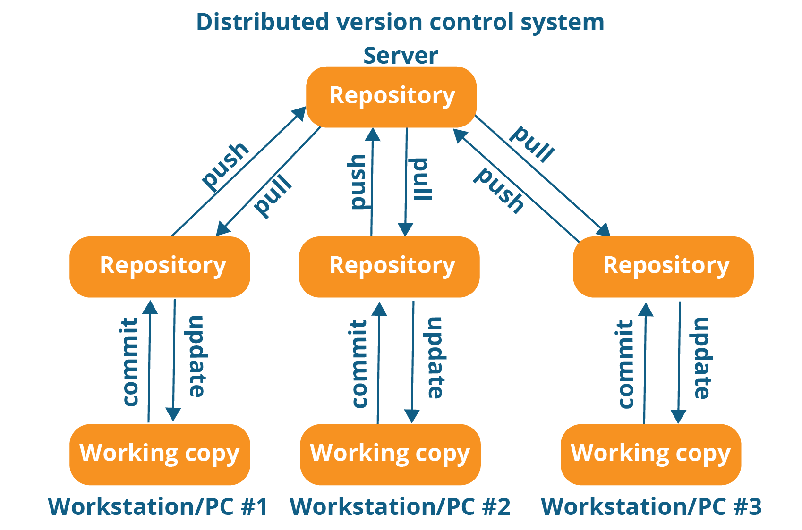

# Using Git


## What is git? (1)
> Git is an open source, distributed 
> version control system. 

- **control system**: can be used to store content (mostly code)
- **versioned**: keeps track of multiple versions and the entire history
- **distributed**: git has a central repository and a number of local repos

## What is git? (2)
```{r pressure, echo=FALSE, fig.cap="A caption", out.width = '90%'}

```

## Using git and github (1)
- code should always be versioned $\rightarrow$ we want to use `git`
    - 1: `usethis::use_git()` initiates a local git repo
    - 2: `usethis::use_github()` links the local repo to github
    
- it is required to have  [github.com](github.com) account
- we need to set up authentification, either 
    - `usethis::browse_github_pat()` using an access token or
    - using public/private key authorization, see `?usethis::use_github`
- Good documentation can be found [**here**](https://usethis.r-lib.org/articles/articles/usethis-setup.html)

## Using git and github (2)

Creating a local git repository

```{r, eval = FALSE}
usethis::use_git()
```

- this function initiates the local repo 
- it asks to also commits all existing files (you should says `yes` here)
- also say yes, if you are asked whether Rstudio should be restarted

## Using git and github (3)

- Authorization to github (via token)
```{r, eval = FALSE}
usethis::browse_github_pat() # create a access token/pattern
usethis::edit_r_environ() # add it to the .Renviron file
```

- The token is like a password (and should be kept as such)
- The `.Renviron` file should have a line in the following format:

```{r comment='', echo = FALSE}
cat(readLines("files/Renviron"), sep = "\n")
```

- Next step: create remote repo on github and push our code

```{r, eval = FALSE}
usethis::use_github()
```
 
- modifies `DESCRIPTION` adding `URL` and `BugReports` fields
- Note: this linkage may also be done manually, `usethis` is not required
